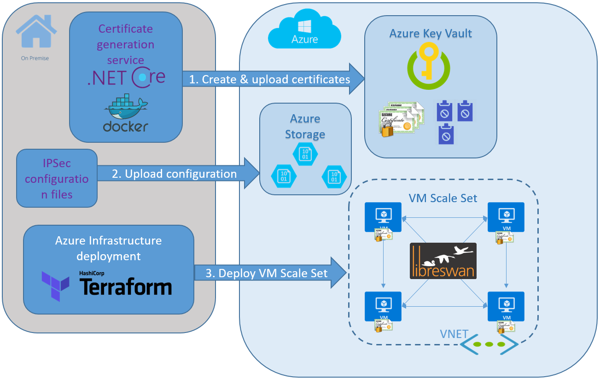
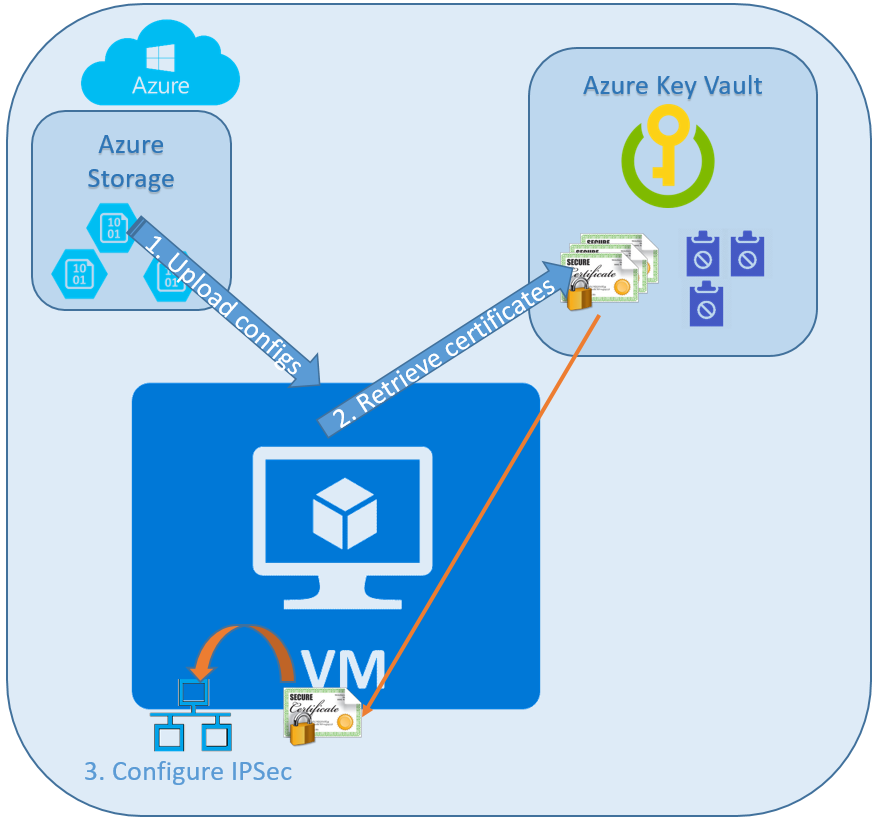

## Introduction 

This project is a reference solution for configuring IPSec networking between all the VMs in a deployment. This solution uses LibreSwan opportunistic IPSec feature. There are configuration examples for a single and multiple VNETs with linux VMs, we use VM Scale Sets for VMs cluster provisioning.

Infrastructure is defined and deployed via a Terraform or ARM templates. The templates defines a custom script extension that downloads and runs the necessary scripts on each VM. The script files are hosted as blobs in Azure Storage.

Opportunistic IPSec uses pre-provisioned unique signed certificates, created for each host. Certificates are securely stored in Key Vault. Access to Key Vault is secured via Managed Service Identity (MSI).

## Prerequisites

- [Docker CE](https://www.docker.com/get-docker)
- [Terraform](https://www.terraform.io/downloads.html)
- Python 3.5
- Azure subscription
- .NET Core 2.0
- Bash
- Azure CLI

## Components

- Terraform template that provides the following:
    - Deploys VM scale set
    - Specifies a custom script extension that downloads and executes the scripts on first boot
    - Configures MSI on the VM scale set
- A certificate generation service to generate signed certificates on demand and upload them to the Azure Key Vault
    - Dockerfile and shell scripts to build the docker image with the service and run it
- VM scripts
    - Bootstrap script to install dependencies
    - Python scripts to download certificate from the keyvault
    - Bash script to configure opportunistic IPSec
- Helper scripts to demonstrate end-to-end deployment

## Single VNET Deployment Process

1. Preprovision unique signed certificates for each host and upload them to Azure Key Vault
2. Upload configuration files to Azure Storage
3. Provision VM Scale Set with Custom Script and MSI extensions
4. Custom Script extension runs `bootstrap.sh` script
    - Install required packages
    - Download host assigned certificate from Azure Key Vault
    - Download CA certificates chain
    - Configure IPSec policies
    - Start IPSec service

## Hosts Configuration

[Details about host configuration](vm-files/README.md)

## Deployment Demo

[Complete end-to-end deployment demo](scripts/README.md)

## Contributing

This project welcomes contributions and suggestions.  Most contributions require you to agree to a
Contributor License Agreement (CLA) declaring that you have the right to, and actually do, grant us
the rights to use your contribution. For details, visit https://cla.microsoft.com.

When you submit a pull request, a CLA-bot will automatically determine whether you need to provide
a CLA and decorate the PR appropriately (e.g., label, comment). Simply follow the instructions
provided by the bot. You will only need to do this once across all repos using our CLA.

This project has adopted the [Microsoft Open Source Code of Conduct](https://opensource.microsoft.com/codeofconduct/).
For more information see the [Code of Conduct FAQ](https://opensource.microsoft.com/codeofconduct/faq/) or
contact [opencode@microsoft.com](mailto:opencode@microsoft.com) with any additional questions or comments.